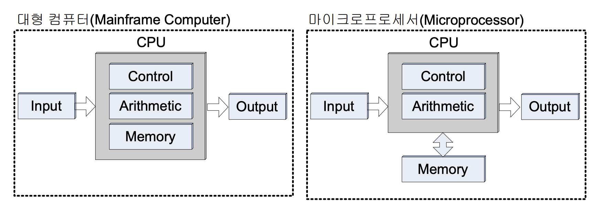
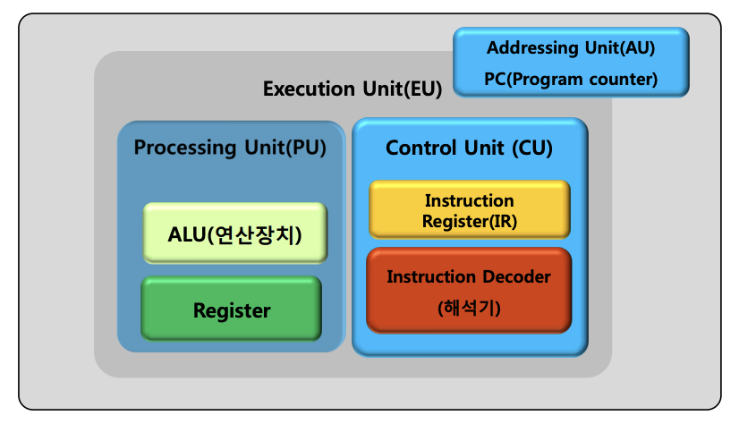

- Microprocessor cache

    - EU(Execution Unit, 실행유니트)
        - Processing Unit+Control Unit
        - 마이크로프로세서의 명령어를 수행
    - CU(Control Unit)
        - CPU가 메모리에서 가져온 명령어를 해석, EU에서 실행할 수 있도록 제어
    - AU(Addressing Unit)
        - CPU가 메모리나 입출력 장치에서 데이터를 읽고 쓸 때 메모리/입출력 어드레스를 생성
